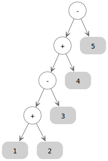
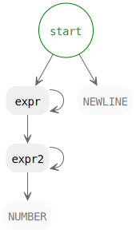

stde.pegen guide
================

.. Code examples are tested in tests/v2/doc_tests/test_guide.py.

Parsing a simple arithmetic expression
--------------------------------------

First we write a grammar::

    grammar = '''
    start: NUMBER "+" NUMBER NEWLINE $
    '''

The ``start`` rule is the entry point of the grammar, and every grammar needs one.
It means, to match the input:

- First match a number (NUMBER)
- Then match the character "+"
- Then match another number (NUMBER)
- There is also a NEWLINE to match, even if the input doesn't contain one.
  This is a limitation due to the default mode using Python's tokenization,
  which always ensures a newline at end of input for easy line processing.
  However, now we don't process lines, so we just cope with it.
- Then it must be the end of the input ($). If there is still text,
  it is a syntax error.

Now we can generate a parser class from the grammar's logic::

    from stde.pegen.build_v2 import generate_parser_from_grammar

    grammar = '''
    start: NUMBER "+" NUMBER NEWLINE $
    '''

    parser_class = generate_parser_from_grammar(grammar).parser_class

Let's parse ``1 + 2`` with this grammar. We need to create a parser instance for
each input, because they need to keep their own parse cache of the input.

::

    parser = parser_class.from_text("1 + 2")
    result = parser.start()  # Invoke the start rule
    print(result)

The result will be the list of matched objects, each a ``tokenize.TokenInfo`` here::

    [TokenInfo(token.NUMBER, "1", (1, 0), (1, 1), "1 + 2"),
     TokenInfo(token.OP, "+", (1, 2), (1, 3), "1 + 2"),
     TokenInfo(token.NUMBER, "2", (1, 4), (1, 5), "1 + 2"),
     TokenInfo(token.NEWLINE, "", (1, 5), (1, 6), "1 + 2")]

Now to evaluate the expression, first extract the data we want::

    print(int(result[0].string) + int(result[2].string))

which will print 3. The ``.string`` is necessary because the matched type of elements is ``tokenize.TokenInfo``
in the default mode.

.. note::
   If you try to parse "1.0 + 2", you'll get ``ValueError: invalid literal for int() with base 10: '1.0'``
   -- the input gets rejected not by the grammar but through errors in evaluation.
   Similar for "1j + 2".

   In stde.pegen's default mode (we are using it now), the token ``NUMBER`` accepts
   *any Python numeric constant, not limited to integers, but also floats and imaginaries*,
   which is why ``result[0].string`` was "1.0". This kind of matching behavior is intended
   in the original Pegen library, but here it's a gotcha. However, I decided to
   preserve this behavior in default mode.

   If we intend to only accept integers, this kind of error message can be confusing to users
   (it looks like a bug, and you could really argue that it is).
   We will see how to make the error more understandable below. If you want to
   avoid this logic as a whole, pick a different mode as decribed below.

   In this guide, we'll ignore this bump by assuming only integers in input.

Note that the result is ``None`` if the string failed to parse. In that case,
you may raise a SyntaxError from ``parser.make_syntax_error()``::

    parser = parser_class.from_text("1 + a")
    res = parser.start()
    if res is None:
        raise parser.make_syntax_error("Cannot parse expression.")

You will see that the parser calculates the error location::

    Traceback (most recent call last):
      File "file.py", line 11, in <module>
        raise parser.make_syntax_error("Cannot parse expression.")
      File "<unknown>", line 1
        1 + a
            ^
    SyntaxError: Cannot parse expression.

The syntax error's file name is ``<unknown>`` because the parser doesn't know
where the input comes from. But if you know, you can ask it
to put it in the error::

    from stde.pegen.build_v2 import generate_parser_from_grammar

    grammar = '''
    start: NUMBER "+" NUMBER NEWLINE $
    '''

    parser_class = generate_parser_from_grammar(grammar).parser_class

    def evaluate_expression(expr):
        parser = parser_class.from_text(expr)
        res = parser.start()
        if res is None:
            raise parser.make_syntax_error("Cannot parse expression.", "<evaluate_expression input>")
        return int(res[0].string) + int(res[2].string)

    print(evaluate_expression("1 + 2"))
    print(evaluate_expression("1 + a"))

::

    3
    Traceback (most recent call last):
      File "file.py", line 17, in <module>
        print(evaluate_expression("1 + a"))
              ~~~~~~~~~~~~~~~~~~~^^^^^^^^^
      File "file.py", line 13, in evaluate_expression
        raise parser.make_syntax_error("Cannot parse expression.", "<evaluate_expression input>")
      File "<evaluate_expression input>", line 1
        1 + a
            ^
    SyntaxError: Cannot parse expression.

Actions: Evaluate during parsing
--------------------------------

Wouldn't it be much cleaner if we could write this?

::

    parser = parser_class.from_text("1 + 2")
    print("The result is:", parser.start()) # and show "The result is: 3"

To do this, we add actions in our grammar. This means we calculate partial results during parsing
which can be useful and more readable in bigger grammars.

::

    grammar = '''
    start: a=NUMBER "+" b=NUMBER NEWLINE $ { int(a.string) + int(b.string) }
    '''

- We name the first number ``a`` and the second ``b``. This is equivalent to having the variables
  ``a`` and ``b`` defined to their result in the action.
- We calculate the result in the action, signified by curly braces:

  .. code-block:: none

      { int(a.string) + int(b.string) }

  This evaluates the Python expression

  ::

      int(a.string) + int(b.string)

  and returns it as the parse result, instead of a list of tokens by default.

.. note::
   Due to current limitations, action code must be expressions that can fit in a return statement
   like ``return {action_code}``.

   If action code returns ``None``, it is treated that the rule failed to match,
   so don't do that unless you know what you're doing.

   .. TODO: Test above statement

   If you don't add any actions, the parsed data isn't lost (a list of matched objects gets returned),
   but they are harder to use.

Our upgraded code::

    # Previous code unchanged
    def evaluate_expression(expr):
        parser = parser_class.from_text(expr)
        res = parser.start()
        if res is None:
            raise parser.make_syntax_error("Cannot parse expression.", "<evaluate_expression input>")
        return res
    print(evaluate_expression("1 + 2"))
    print(evaluate_expression("1 + a"))

Extend our grammar
------------------

Since the first heading said "Parsing a simple arithmetic expression", you may have wondered where the
subtraction, multiplication and division support is. Let's implement them now!

.. note::
   I recommend reading :doc:`/peg_parsers` before reading on.

Subtraction; or, using choices
~~~~~~~~~~~~~~~~~~~~~~~~~~~~~~

Our grammar should look like this::

    number operator number

where ``operator`` is ``+`` or ``-``. It can be expressed with ``|``::

    grammar = '''
    start: a=NUMBER op=("+"|"-") b=NUMBER NEWLINE $ { (see below) }
    '''

and our action would become

.. code-block:: none

    { int(a.string) + int(b.string) if op.string == "+" else int(a.string) - int(b.string) }

Here's another style that puts the choice at the top of the rule
and sets actions for each choice.

::

    start: a=NUMBER "+" b=NUMBER NEWLINE $ { int(a.string) + int(b.string) }
         | a=NUMBER "-" b=NUMBER NEWLINE $ { int(a.string) - int(b.string) }

If start-a-new-line indentation looks more confortable to you, you can write this.
Note that an extra ``|`` is needed on the first line.

::

    start:
        | a=NUMBER "+" b=NUMBER NEWLINE $ { int(a.string) + int(b.string) }
        | a=NUMBER "-" b=NUMBER NEWLINE $ { int(a.string) - int(b.string) }

Now try parsing ``1 - 2`` with the updated grammar.

.. note::
   If you read the source code and older docs, you will find "choices" called "alts"/"alternatives".

Compound expressions
~~~~~~~~~~~~~~~~~~~~

.. NOTE This section's example is not yet tested.

So far we've only handled adding and subtracting of 2 numbers. To handle more, e.g.

::

    1 + 2 - 3 + 4 - 5

the usual approach is to match subexpressions and combine them::

    (((1 + 2) - 3) + 4) - 5

Now on two sides of the operator is no longer always numbers,
but might be a subexpression.
That subexpression may in turn contain *another* subexpression; etc.

To deal with this recursion, we can rewrite the grammar like this::

    grammar = '''
    start: expr NEWLINE $ { expr }

    expr:
        | a=expr "+" b=NUMBER { a + int(b.string) }
        | a=expr "-" b=NUMBER { a - int(b.string) }
        | NUMBER { int(number.string) }
    '''

.. note::
   If you don't understand why the ``NUMBER`` branch has to come last,
   read :doc:`/peg_parsers`.

Here in the action of ``start`` and the last choice of ``expr``, we write variables ``expr`` and ``number``
to refer to grammar elements ``expr`` and ``NUMBER`` without giving them a name.
This is a feature of stde.pegen: If an element's name is the first occurence in a choice,
the element is by default assigned to its name transformed into lowercase (e.g. ``NUMBER`` → ``number``).

This grammar reads as follows:

- ``start``: Match an expression.
- ``expr``:

  - If ``expr "+" NUMBER`` can be matched (e.g. ``1 + 2 + 3``; imagine ``(1 + 2) + 3``
    though the brackets are not present, where subexpression ``expr`` = ``1 + 2``),
    its result is the result of the sub-expression ``expr``
    added with the result of the number ``NUMBER``.
  - Similar for the second choice, but subtract.
  - If ``expr`` always tries to match ``expr``, there will be infinite recursion.
    The expression must start with a number first, so we define it
    as the base case (3rd choice).

``expr`` is called to be left-associative because the expression is calculated from left to right
(``1 + 2 + 3`` = ``(1 + 2) + 3``). This is true because the following fact holds recursively:
For every execution of ``expr`` (excluding the last choice, because it is irrelevant here):

.. code-block:: none

    | a=expr "+" b=NUMBER { a + int(b.string) }
    | a=expr "-" b=NUMBER { a - int(b.string) }

the current ``expr`` calculates its left side ``a=expr`` before it is calculated.

For comparison, here is a right-associative version of ``expr``::

    grammar = '''
    start: expr NEWLINE $ { expr }

    expr:
        | a=NUMBER "+" b=expr { int(a.string) + b }
        | a=NUMBER "-" b=expr { int(a.string) - b }
        | NUMBER { int(number.string) }
    '''

where the parser will calculate the right side ``expr`` of the current ``expr``
before it is calculated (``1 + 2 + 3`` = ``1 + (2 + 3)``).

(For now left or right associative is not important to the result because
addition and subtraction is associative.)

Now our grammar also accepts a single number without operators;
this makes sense (a number as an expression) and the grammar is simpler
allowing than disallowing, so we'll just allow it.

.. note::
   Currently, don't give rule names starting with ``invalid_``.

Multiplication and division; or, making precedence
~~~~~~~~~~~~~~~~~~~~~~~~~~~~~~~~~~~~~~~~~~~~~~~~~~

It is wrong to write

.. code-block:: none

    expr:
        | a=expr "+" b=NUMBER { a + int(b.string) }
        | a=expr "-" b=NUMBER { a - int(b.string) }
        | a=expr "*" b=NUMBER { a * int(b.string) }
        | a=expr "/" b=NUMBER { a / int(b.string) }

because it would calculate ``1 + 2 * 3`` as ``(1 + 2) * 3`` = ``9`` instead of as ``1 + (2 * 3)`` = ``7``.

Because the bottom rule is calculated before rules that invoke it (thus having higher precedence),
we can try making a recursion layer where

- ``expr`` calculates ``+`` and ``-`` only, and must enter ``expr2``
- ``expr2`` calculates ``*`` and ``/`` only
- ``expr2`` serves as the base case, which here means matching a single number to build upon

This makes a precedence layer of ``*, / > +, -``.

Here is a sample solution::

    start: expr NEWLINE $ { expr }

    expr:
        | a=expr2 "+" b=expr { a + b }
        | a=expr2 "-" b=expr { a - b }
        | expr2

    expr2:
        | a=expr2 "*" b=NUMBER { a * int(b.string) }
        | a=expr2 "/" b=NUMBER { a / int(b.string) }
        | NUMBER { int(number.string) }

.. note::
   Below I'll no longer explain grammar design and focus on stde.pegen's features.

Comments in grammar
-------------------

Python-style comments are allowed in grammar and will be ignored::

    # This is a comment
    start: "a" NEWLINE $ { "a" }  # Branch
         | "b" NEWLINE $ { "b" }  # Another branch

Other things to do with a grammar
---------------------------------

Load from a file
~~~~~~~~~~~~~~~~

In circumstances where it's not good to embed the grammar in code (e.g. same grammar
used across files, or big grammar), it can be loaded from a file via
the ``generate_parser_from_file`` convenience function:

``grammar.txt``

::

    start: expr NEWLINE $ { expr }

    # ...

``file.py``

::

    from stde.pegen.build_v2 import generate_parser_from_file

    grammar = generate_parser_from_file("grammar.txt").parser_class

See the generated code
~~~~~~~~~~~~~~~~~~~~~~

::

    from stde.pegen.build_v2 import generate_parser_from_file

    # This isn't mentioned above, but the return value contains all intermediate products
    # produced when generating the parser class
    products = generate_parser_from_file("grammar.txt")

    # Which is why `.parser_class` is needed
    parser_class = products.parser_class

    # The code that the parser class was compiled from
    print(products.parser_code)

Refer to [build_v2 reference](TODO) for all available byproducts.

Debug grammar matching with verbose mode
~~~~~~~~~~~~~~~~~~~~~~~~~~~~~~~~~~~~~~~~

Useful when debugging the grammar. Set ``verbose_stream`` in ``parser_class.from_text``
to be the output stream. The output shows the steps of matching and backtracking of rules
and their resolved values.

::

    import sys
    parser = parser_class.from_text("...", verbose_stream=sys.stdout)
    res = parser.start()  # Prints verbose output

Graphing the grammar
~~~~~~~~~~~~~~~~~~~~

.. note::
   This section and the next assumes you have the last version of the grammar
   in section "Multiplication and division; or, making precedence" above
   stored as ``grammar.txt``.

   [TODO: data dir?]

[This interface is TODO]

.. note::
   This requires GraphViz installed.

Generate a graph of the grammar with

::

    python -m stde.pegen.grammar_grapher_2 grammar.txt | dot -Tsvg > grammar.svg

If you don't know an app that can open SVG, your browser will handle it.

Explore what's possible with ``python -m stde.pegen.grammar_grapher_2 -h``.

Querying the grammar
~~~~~~~~~~~~~~~~~~~~

[This interface is TODO and incomplete]

Curious about which rules use ``NUMBER`` directly?

::

    python -m stde.pegen.grammar_searcher grammar.txt "NUMBER:==1"

[TODO]

Single quoted words as keywords (default mode only)
~~~~~~~~~~~~~~~~~~~~~~~~~~~~~~~~~~~~~~~~~~~~~~~~~~~

[TODO]

Some useful metas
-----------------

Let's look at some useful metas. They are special grammar statements
that must be put before all rules. They each have a *value* in the format

::

    @meta_name Value
    @meta_name "Value"
    @meta_name '''
    dum\tde\ndum
    '''

The value follows the ``@meta_name``. It is always a string and can be
any valid Python string (excluding f-strings).
If it fits in the format of a Python identifier,
it can be written as an identifier (first meta).
The first and second metas above are equivalent.

Most metas cannot be stated more than once.

``@header``
~~~~~~~~~~~

This includes a string of code before the code of the generated parser, but after the [metaheader](TODO).

Let's move some of our action code to the header:

.. code-block:: none

    @header """
    def token_to_int(t):
        return int(t.string)
    """

    start: expr NEWLINE $ { expr }

    expr:
        | a=expr2 "+" b=expr { a + b }
        | a=expr2 "-" b=expr { a - b }
        | expr2

    expr2:
        | a=expr2 "*" b=NUMBER { a * token_to_int(b) }
        | a=expr2 "/" b=NUMBER { a / token_to_int(b) }
        | NUMBER { token_to_int(number) }

``@trailer``
~~~~~~~~~~~~

This includes a string of code after all generated code. We won't use it in this guide, but it may be useful
if you want to use the generated code as a command line program [TODO: link].

The default value is::

    if __name__ == '__main__':
        from pegen.parser_v2 import simple_parser_main
        simple_parser_main(GeneratedParser)

.. note::
   ``GeneratedParser`` changes if you use the [``@class`` meta](TODO).

``@base``
~~~~~~~~~
The generated parser class inherits a base class for some basic functionality::

    class GeneratedParser(BaseClass):
        # The rules of the grammar

``BaseClass`` is the value of ``@base``. It is ``DefaultParser`` by default.

When this meta is not specified, the base class may still be changed by ``@preset``;
see below.

An example of ``@base`` is described below.

[TODO: Feel very weak writing this]

``@locations_format``
~~~~~~~~~~~~~~~~~~~~~
[TODO]

``@preset``
~~~~~~~~~~~

[This feature is TODO]

The preset to use for the grammar. By default, the default preset is used, equivalent to
``@preset default``. Currently the only other supported preset is ``char_based``.
Presets are described below.

Match character by character with ``CharBasedParser``
-----------------------------------------------------

So far we have been using ``DefaultParser`` as the base parser. However, it has some limitations:

- We can't match character by character, because everything we access through ``DefaultParser``
  is already processed by Python's tokenizer. For example, if we write ``"a" "b"``,
  it will only match ``a b``, and not ``ab``. This can be an obstacle
  when matching character by character is really convenient. Similarly,
  ``"!" "="`` will not match ``"!="`` which may be convenient when matching Python
  but can be an obstacle.
- We lack features like regex matching or matching "any character".
- Its pre-tokenization skips whitespace in a way beyond our control.

stde.pegen provides another base parser: ``CharBasedParser``, which does no tokenizing and
allows matching character by character.

Use it through

.. code-block:: none

    @base CharBasedParser

To demonstrate its advantages, let's write a parser that parses a
`Graphviz color <https://graphviz.org/docs/attr-types/color/>`_ (the RGB and RGBA formats only).
It will return a tuple of (R, G, B, A) (when alpha is omitted, we take alpha=255).

.. code-block:: none

    @base CharBasedParser

    start: "#" r=field g=field b=field a=field { (int(r, 16), int(g, 16), int(b, 16), int(a, 16)) }
         | "#" r=field g=field b=field { (int(r, 16), int(g, 16), int(b, 16), 255) }

    field: a=char b=char { a + b }
    char: "0" | "1" | "2" | "3" | "4" | "5" | "6" | "7" | "8" | "9"
        | "a" | "b" | "c" | "d" | "e" | "f"
        | "A" | "B" | "C" | "D" | "E" | "F"

This grammar will parse ``#ff33cc`` as ``(255, 51, 204, 255)``, ``#002134aa`` as ``(0, 33, 52, 170)``,
and rejects ``#0021 34aa``.

.. note::
   You cannot just list "0-9a-fA-F" for rule ``char`` yet. This feature is TODO.

Parser presets (aka modes)
--------------------------

.. note::
   You will also find presets called modes in this documentation.

Custom rules
-------------------

.. Canceled because I doubt the relevant source code.
..
.. ``invalid_`` rules: probe for specifc error messages
.. ----------------------------------------------------

Default mode (``@preset default``)
~~~~~~~~~~~~~~~~~~~~~~~~~~~~~~~~~~

Char-based mode (``@preset char_based``)
~~~~~~~~~~~~~~~~~~~~~~~~~~~~~~~~~~~~~~~~